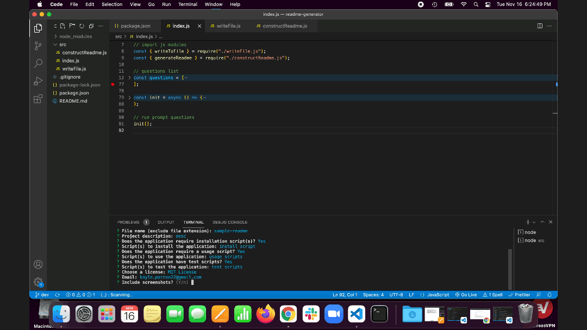

# README Generator 

## Table of Contents

- [Description](#description)
  - [Technologies](#technologies)
- [Getting Started](#getting-started)
  - [Installation](#installation)
  - [Usage](#usage)
- [Contributing](#contributing)
- [License](#license)
- [Screenshots](#screenshots)

## Description

Command line professional README generator using Node.js and the inquirer package. The app takes in user input; generates readme sections including project information, table of contents, and optional script sections; and outputs a formatted markdown file.

### Technologies

- Node.js
- inquirer package

## Getting Started

### Installation

Run the following script to test the application:

```
$ git clone https://github.com/kayleriegerpatton/readme-generator.git
$ cd readme-generator
$ npm install
```

### Usage

Run the following script to use the application:

```
$ npm run start
```

## Contributing

To contribute to this project, please [email](mailto:kayle.patton22@gmail.com) me.

## License

MIT License

## Demo Video

Click to view the [app demo video](https://drive.google.com/file/d/1I4mZf0vGqts_g3VKXO4NY5hkjeJCGh0X/view?usp=sharing)


